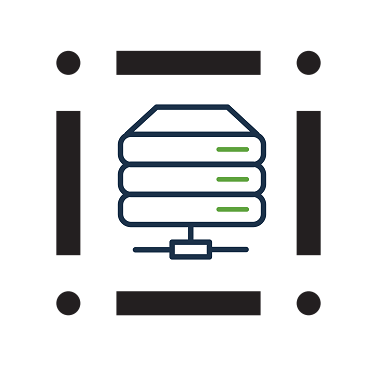

<p align="center">
  
</p>

# United Systems Core Server

United Systems Core Server - server for distributing packages compatible with United Systems Core.

## Commands for controll
- `-i`: Set ip for starting the server.

    ```bash
    main -i 127.0.0.1
    ```
- `-p`: Set port for starting the server.
    ```bash
    main -p 5000
    ```
- `-h`: get help message

## Install

    git clone https://github.com/MrBrain-YT/United-Systems-Core.git

## Run server

```bash
python main -i 127.0.0.1 -p 5000
```
or

```bash
python main
```    
    
## Additional information
United-Systems-Core - https://github.com/MrBrain-YT/United-Systems-Core

test-usc-package - https://github.com/MrBrain-YT/test-usc-package

Discord - https://discord.gg/zAmJG5apZK